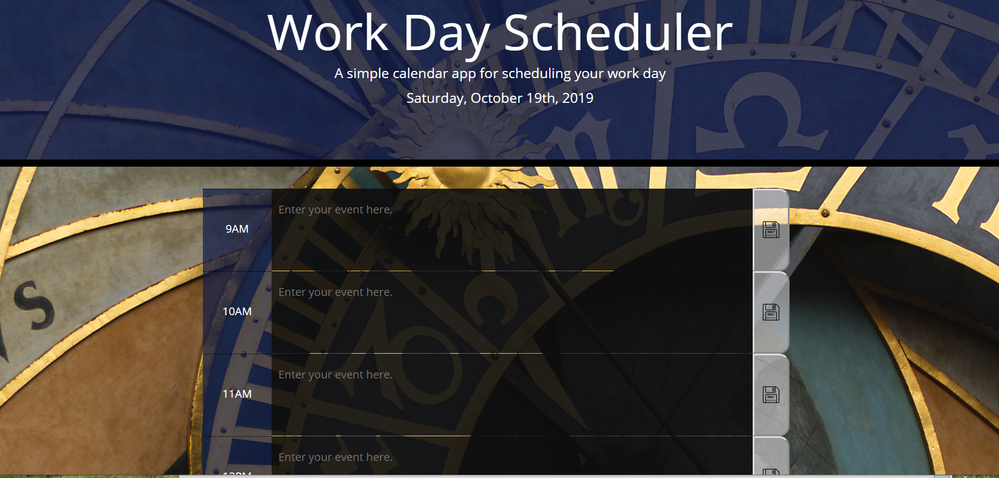

# Daily-Planner-AJ

## Description

This application is designed to help plan your actions and meetings for the day. 

You can access the planner [here.](https://alexandramj92.github.io/Daily-Planner-AJ/)

## Usage

The planner is designed to be responsive so that it is easily usable. See examples below for large and small displays. 

Large display

Small display

All you have to do is input your action item or meeting in the text box with the place holder "Enter your event here." and click on the save icon.

One of the cooler functionalities of this planner is that the text box changes colors depending on the time of day.

If the time slot has passed, the text box becomes dark grey.
If the time is present, the text box becomes red.
If the time has not passed yet, the text box is green.

## Credits

I would like to thank Omar for giving me the knowledge to create this password generator using html ,bootstrap, css, javascript, and jQuery and the TAs for helping me work through some the issues I had with my code.

